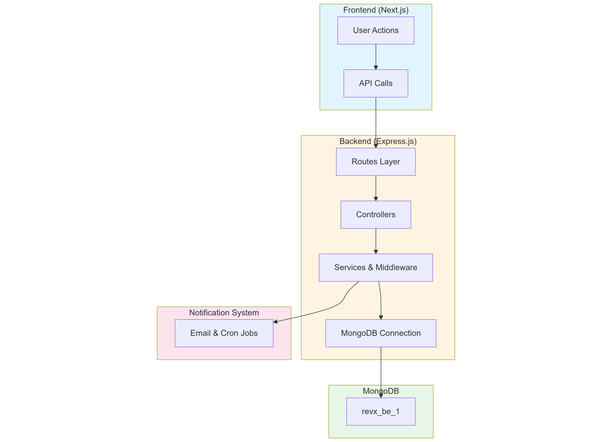

# 🚀 RevX Backend – Employee Performance Review System (Server)

The **RevX Backend** powers the Employee Performance Review System, managing data, authentication, and business logic for HR admins, managers, and employees.  
It provides secure RESTful APIs built using **Node.js**, **Express.js**, and **MongoDB**.

---

## 🧠 Project Overview

This backend handles:
- Role-based authentication (HR / Manager / Employee)
- Goal and task management
- Review cycles and notifications
- Self-assessment and feedback
- Data analytics and reporting APIs

---

## 🏗️ Tech Stack

| Technology | Description |
|-------------|-------------|
|  | JavaScript runtime for backend |
|  | Web application framework |
|  | NoSQL database |
|  | JSON Web Token authentication |
|  | Email notification system |
|  | Automated review reminders |

---

## 🧬 System Architecture

The following diagram illustrates the overall architecture of the **RevX Backend System**:

<p align="center">
  
</p>


=======================================================================
| Feature         | Endpoint             | Method     | Description               |
| --------------- | -------------------- | ---------- | ------------------------- |
| Authentication  | `/api/auth/login`    | POST       | User login (JWT)          |
| User Management | `/api/users`         | POST / GET | Create & fetch users      |
| Departments     | `/api/departments`   | CRUD       | Manage departments        |
| Teams           | `/api/teams`         | CRUD       | Manage teams and members  |
| Goals           | `/api/goals`         | CRUD       | Set and track goals       |
| Tasks           | `/api/tasks`         | CRUD       | Assign and manage tasks   |
| Reviews         | `/api/reviews`       | POST / PUT | Create goal/task review   |
| Notifications   | `/api/notifications` | GET        | Send alerts and reminders |
| Reports         | `/api/reports`       | GET        | Analytics and summaries   |

==========================================================================

# 🚀 Quick Start Guide

## Backend Setup

```bash
# Clone and setup
git clone https://github.com/ThilshathSmt/revx-be.git
cd revx-be
npm install

# Configure .env
touch .env
```

Add to `.env`:
```env
MONGO_URI=mongodb://localhost:27017/revx_be_1
JWT_SECRET=your-secret
PORT=5001
```

```bash
# Start server
npm run dev
```

---

## Frontend Setup

```bash
# Clone and setup
git clone https://github.com/ThilshathSmt/revx-fe.git
cd revx-fe
npm install

# Configure .env
touch .env
```

Add to `.env`:
```env
NEXTAUTH_URL=http://localhost:3000
NEXTAUTH_SECRET=your-secret
NEXT_PUBLIC_BACKEND_URL=http://localhost:5001
```

```bash
# Start app
npm run dev
```

---

## 📋 Quick Reference

| Service  | URL                      | Port |
|----------|--------------------------|------|
| Frontend | http://localhost:3000    | 3000 |
| Backend  | http://localhost:5001    | 5001 |
| MongoDB  | mongodb://localhost:27017| 27017|

---

## ✅ Verify Installation

```bash
# Check backend
curl http://localhost:5001/api/health

# Check frontend
# Open browser: http://localhost:3000
```
==========================================================================

| Member           | Role                 | Contribution                                      |
| ---------------- | -------------------- | ------------------------------------------------- |
| **Thilshath SM** | Full Stack Developer | Review Scheduling, Notifications, API Integration |
| **Faskath MHM**  | Full Stack Developer | Authentication & Role Management (JWT / RBAC)     |
| **Muadh MRM**    | Full Stack Developer | Goal & Task APIs, CRUD Operations                 |
| **Fadhil MFM**   | Full Stack Developer | Feedback & Self-assessment APIs                   |
| **Haneef MNAR**  | Full Stack Developer | Reporting & Analytics APIs                        |

=========================================================================

| Command       | Description               |
| ------------- | ------------------------- |
| `npm run dev` | Start backend in dev mode |
| `npm start`   | Start in production mode  |
| `npm test`    | Run backend tests         |

=============================================================================

<p align="center">
  
</p>

==========================================================================

📊 Deployment

Can be hosted on Render / EC2 / Vercel

Update .env with production MongoDB URI

Configure email credentials for Nodemailer
